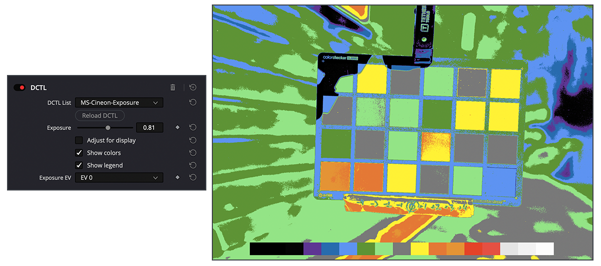
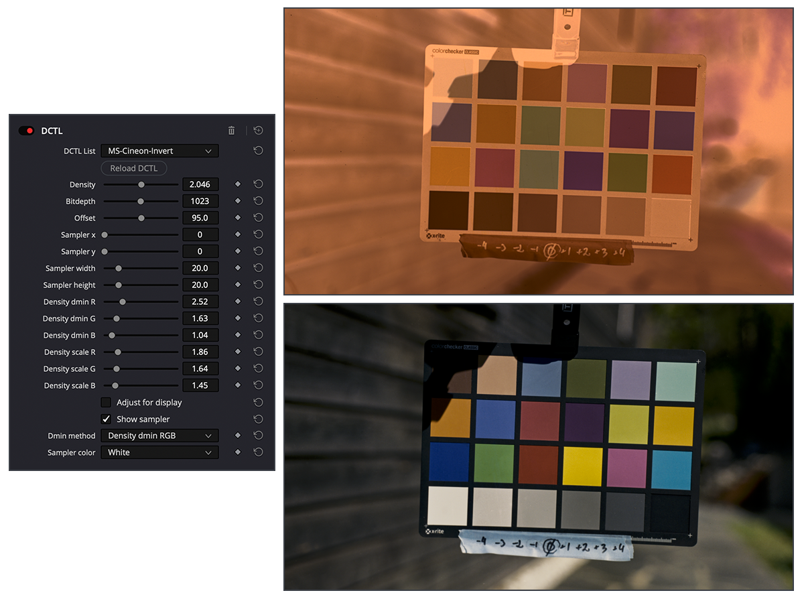
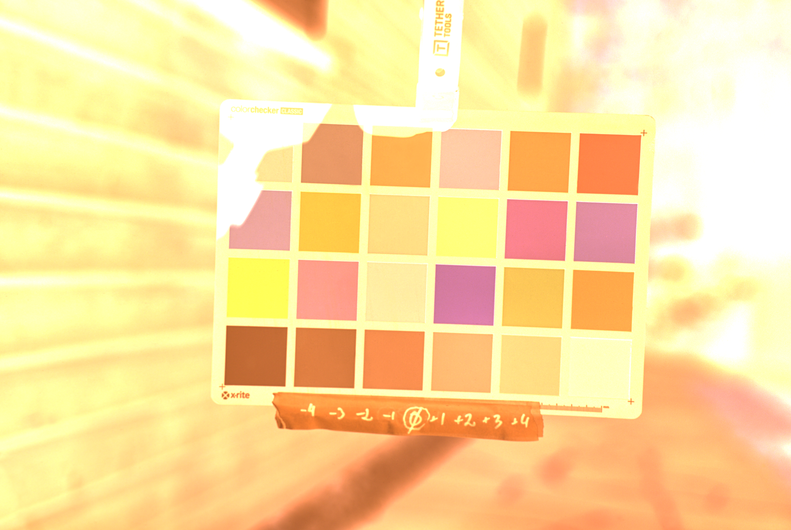
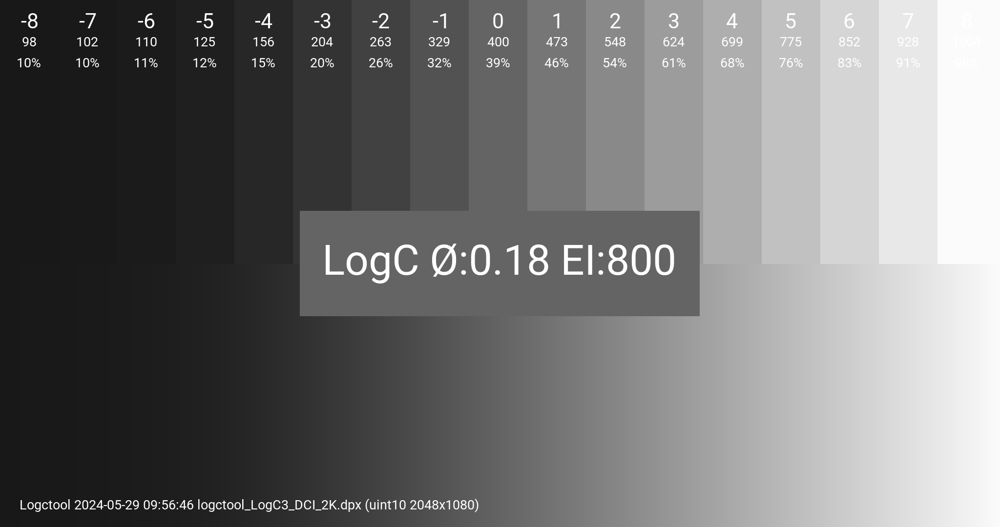
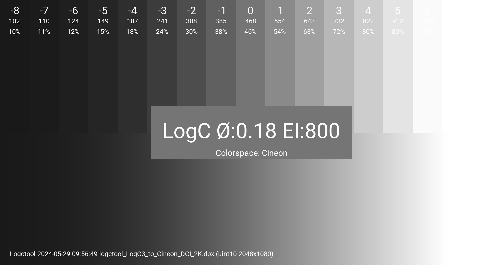

# DCTL #

[](https://github.com/mikaelsundell/icloud-snapshot/blob/master/license.md)

Table of Contents
=================

- [DCTL](#dctl)
- [Table of Contents](#table-of-contents)
  - [Introduction](#introduction)
  - [Installation and utils](#installation-and-utils)
- [DCTLs](#dctls)
  - [Cineon color processing](#cineon-color-processing)
    - [MS-Cineon-Exposure.dctl](#ms-cineon-exposuredctl)
    - [MS-Cineon-Invert.dctl](#ms-cineon-invertdctl)
      - [Cineon inversion](#cineon-inversion)
      - [ACES scene-linear and calibration curves](#aces-scene-linear-and-calibration-curves)
    - [MS-Cineon-Transform.dctl](#ms-cineon-transformdctl)
  - [LogC3 color processing](#logc3-color-processing)
    - [MS-LogC3-Print.dctl](#ms-logc3-printdctl)
    - [MS-LogC3-Exposure.dctl](#ms-logc3-exposuredctl)
    - [MS-LogC3-Transform.dctl](#ms-logc3-transformdctl)
  - [Utility DCTLs](#utility-dctls)
    - [MS-Stripify.dctl](#ms-stripifydctl)
    - [MS-Saturation.dctl](#ms-saturationdctl)
  - [DCTLs from other projects](#dctls-from-other-projects)
    - [Film Grain.dctl](#film-graindctl)
    - [Printer Lights.dctl](#printer-lightsdctl)
    - [TetraInterp.dctl](#tetrainterpdctl)
    - [TetraInterpHSV.dctl](#tetrainterphsvdctl)
  - [Reference charts](#reference-charts)
  - [References](#references)
  - [Web Resources](#web-resources)

Introduction
---------

A continuously updated collection of DCTLs (DaVinci Color Transform Language) designed to enhance and educate on workflows using ARRI LogC3 and Cineon in DaVinci Resolve. These DCTLs offers a photographic and creative approach to color correction and grading from log digital and film negatives, emphasizing the artistic tweaking of the many variables involved rather than a strictly scientific method.
  
Installation and utils
---------

To use these tools into your DaVinci Resolve setup, begin by cloning the git repository, which contains the DCTLs and headers.

Run `python(.exe) run.py install` in your terminal to copy the `*.dctl` and `*.h` files to the DaVinci Resolve LUT DCTL folder, ensuring they're accessible within your Resolve environment. The files can also be manually copied to `/Library/Application Support/Blackmagic Design/DaVinci Resolve/LUT/DCTL` on Mac and `C:\ProgramData\Blackmagic Design\DaVinci Resolve\Support\LUT\DCTL`on Windows.

For added convenience, the run.py script is provided, enabling easy access to various resources:

**To open the DCTL readme documentation, use:**

```shell
./run.py readme
````

**For exploring DCTL examples, execute:**

```shell
./run.py examples
````

**To access the DaVinci Resolve log file and initiate a trace, input:**

```shell
./run.py install
````

**To install *.dctl and *.h into DCTL directory:**

```shell
./run.py log
````

**To make a snapshot of hte DaVinvi Resolve DCTL folder, input:**

```shell
./run.py snapshot
````

# DCTLs

## Cineon color processing

### MS-Cineon-Exposure.dctl



Cineon exposure from photographic stops, incorporating a zone based false color to aid in achieving correct exposure levels.

- https://github.com/mikaelsundell/dctl/blob/master/MS-Cineon-Exposure.dctl

### MS-Cineon-Invert.dctl

#### Cineon inversion



Cineon negative inversion with precise control over the dmin ratio based inversion process using adjustable parameters such as density, bit depth, offset, and density scale. You can specify dmin base values manually as floating-point numbers (obtained from tools like Pixel Analyzer in Nuke or similar software) or sample them using a rectangular sampler from the border or other dmin base areas.

#### ACES scene-linear and calibration curves

To account for the variations of film stock and the use of ECN-2 chemicals, developer time and temperature, camera and lightbox settings - calibration curves are applied to match ideal cineon code values. In this example, photoscanning was used along with the rawtoaces tool to convert the Camera RAW CR2 file to scene-linear ACES, starting with as much information as possible. However, because the science is not exact, manual tweaking using density scaling and calibration curves is needed depending on the setup.


Color calibration curves and macbeth charts at different exposures for adjustments.

**DCTL script**

- https://github.com/mikaelsundell/dctl/blob/master/MS-Cineon-Invert.dctl

**rawtoaces project**

- https://github.com/AcademySoftwareFoundation/rawtoaces

### MS-Cineon-Transform.dctl

Cineon conversion to and from linear. 

- https://github.com/mikaelsundell/dctl/blob/master/MS-Cineon-Transform.dctl

## LogC3 color processing

### MS-LogC3-Print.dctl


Made for print emulation, this DCTL applies DaVinci Resolve's built-in film looks to ARRI LogC3 and Cineon footage with adjustable controls for contrast and color strength.

- https://github.com/mikaelsundell/dctl/blob/master/MS-LogC3-Print.dctl

### MS-LogC3-Exposure.dctl


LogC3 exposure from photographic stops, incorporating a zone based false color to aid in achieving correct exposure levels.

- https://github.com/mikaelsundell/dctl/blob/master/MS-LogC3-Exposure.dctl

### MS-LogC3-Transform.dctl

LogC3 conversion to and from linear. 

- https://github.com/mikaelsundell/dctl/blob/master/MS-LogC3-Transform.dctl

## Utility DCTLs

### MS-Stripify.dctl

Matrix adjustments, this DCTL simplifies the color palette by pushing colors into a warm and cool strip.

- https://github.com/mikaelsundell/dctl/blob/master/MS-Stripify.dctl

### MS-Saturation.dctl

HSV-based adjustments, this DCTL provides a tool for fine-tuning saturation using saturation in HSV.

- https://github.com/mikaelsundell/dctl/blob/master/MS-Saturation.dctl

## DCTLs from other projects

### Film Grain.dctl

- https://github.com/thatcherfreeman/utility-dctls/blob/main/Effects/Film%20Grain.dctl

### Printer Lights.dctl

- https://github.com/thatcherfreeman/utility-dctls/blob/main/Utilities/Printer%20Lights.dctl

### TetraInterp.dctl

-  https://github.com/hotgluebanjo/TetraInterp-DCTL/blob/master/TetraInterp.dctl

### TetraInterpHSV.dctl

- https://github.com/hotgluebanjo/TetraInterp-DCTL/blob/master/TetraInterpHSV.dctl

## Reference charts

 - ACES Macbeth 50D 5203 EXR exr from rawtoaces



- Download: [macbeth_50D_5203.exr](resources/macbeth_50D_5203.exr)

ARRI LogC3 10-bit DPX



- Download: [logctool_LogC3_DCI_2K.dpx](resources/logctool_LogC3_DCI_2K.dpx)

Cineon 10-bit DPX



- Download: [logctool_LogC3_to_Cineon_DCI_2K.dpx](resources/logctool_LogC3_to_Cineon_DCI_2K.dpx)

Logctool project:

- https://github.com/mikaelsundell/logctool

References
---------

ARRI Companion to DI
* https://dicomp.arri.de/digital/digital_systems/DIcompanion/index.html
  
Blend modes:
* https://skia.googlesource.com/skia/+/70e432e72745/gm/hsl.cpp

Cineon conversion in RV:
* https://github.com/AcademySoftwareFoundation/OpenRV/blob/main/src/plugins/rv-packages/additional_nodes/LinearToCineonLog.glsl
* https://github.com/AcademySoftwareFoundation/OpenRV/blob/main/src/plugins/rv-packages/additional_nodes/CineonLogToLinear.glsl

Grayscale legacy luma:
* https://en.wikipedia.org/wiki/Grayscale


 Web Resources
-------------

* GitHub page:        https://github.com/mikaelsundell/dctl
* Issues              https://github.com/mikaelsundell/dctl/issues
