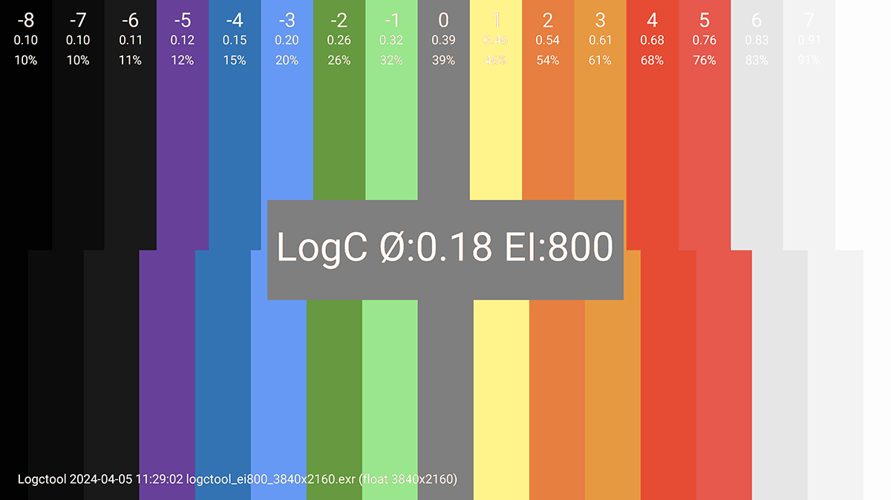
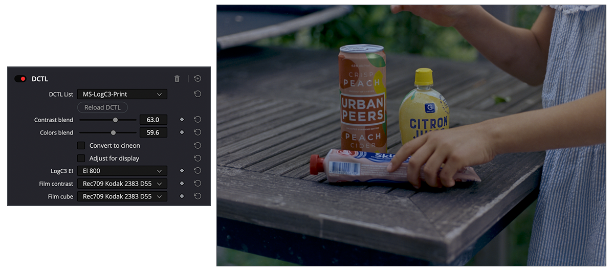

Readme for dctl
====================

[](https://github.com/mikaelsundell/icloud-snapshot/blob/master/license.md)

Table of Contents
=================

- [Readme for dctl](#readme-for-dctl)
- [Table of Contents](#table-of-contents)
  - [Introduction](#introduction)
  - [Installation and utils](#installation-and-utils)
- [DCTLs](#dctls)
  - [MS-LogC3-Exposure.dctl](#ms-logc3-exposuredctl)
  - [MS-LogC3-Print.dctl](#ms-logc3-printdctl)
  - [MS-Stripify.dctl](#ms-stripifydctl)
  - [MS-Saturation.dctl](#ms-saturationdctl)
  - [DCTLs from other projects](#dctls-from-other-projects)
    - [Film Grain.dctl](#film-graindctl)
    - [Printer Lights.dctl](#printer-lightsdctl)
    - [TetraInterp.dctl](#tetrainterpdctl)
    - [TetraInterpHSV.dctl](#tetrainterphsvdctl)
  - [LogC3 EI800 reference chart](#logc3-ei800-reference-chart)
  - [Documentation](#documentation)
  - [Web Resources](#web-resources)

Introduction
---------

A collection of continuously updated DCTLs (DaVinci Color Transform Language), primarily aimed at enhancing workflows using ARRI LogC3 in DaVinci Resolve. These DCTLs are  designed for photographers and cinematographers seeking a photographic approach to color correction and grading.
  
Installation and utils
---------

To use these tools into your DaVinci Resolve setup, begin by cloning the git repository, which contains the DCTLs and headers.

Run `./build.sh` in your terminal to copy the `*.dctl` and `*.h` files to the DaVinci Resolve LUT DCTL folder, ensuring they're accessible within your Resolve environment. The files can also be manually copied to `/Library/Application Support/Blackmagic Design/DaVinci Resolve/LUT/DCTL`

For added convenience, the open.sh script is provided, enabling easy access to various resources:

**To open the DCTL readme documentation, use:**

```shell
./run.sh readme
````

**For exploring DCTL examples, execute:**

```shell
./run.sh examples
````

**To access the DaVinci Resolve log file and initiate a trace, input:**

```shell
./run.sh log
````

**To make a snapshot of hte DaVinvi Resolve DCTL folder, input:**

```shell
./run.sh snapshot
````

# DCTLs

## MS-LogC3-Exposure.dctl



This script is crafted for precise exposure adjustments within ARRI LogC3 footage, incorporating a false color to aid in achieving correct exposure levels.

- https://github.com/mikaelsundell/dctl/blob/master/MS-LogC3-Exposure.dctl

## MS-LogC3-Print.dctl



Made for print emulation, this DCTL applies DaVinci Resolve's built-in film looks to ARRI LogC3 footage with adjustable controls for contrast and color strength.

- https://github.com/mikaelsundell/dctl/blob/master/MS-LogC3-Print.dctl

## MS-Stripify.dctl

Matrix adjustments, this DCTL simplifies the color palette by push colors into a warm/ cool strip.

- https://github.com/mikaelsundell/dctl/blob/master/MS-Stripify.dctl

## MS-Saturation.dctl

HSV-based adjustments, this DCTL provides a tool for fine-tuning saturation using saturation in HSV.

- https://github.com/mikaelsundell/dctl/blob/master/MS-Saturation.dctl

## DCTLs from other projects

### Film Grain.dctl

- https://github.com/thatcherfreeman/utility-dctls

### Printer Lights.dctl

- https://github.com/thatcherfreeman/utility-dctls

### TetraInterp.dctl

- Copyright © 2021 calvinsilly, Ember Light, Nick Eason

### TetraInterpHSV.dctl

- Copyright © 2021 calvinsilly, Ember Light, Nick Eason

## LogC3 EI800 reference chart

The LogC3 reference chart created using the logctool command:

- [logctool_ei800_3840x2160.exr](resources/logctool_ei800_3840x2160.exr) (https://github.com/mikaelsundell/logctool)

ARRI LogC3 EI800 EXR:

- [logctool_ei800_3840x2160.exr](resources/logctool_ei800_3840x2160.exr)


Documentation
---------

Blend modes, used in MS-LogC3-Print.dctl
* https://skia.googlesource.com/skia/+/70e432e72745/gm/hsl.cpp

Grayscale legacy luma 
* https://en.wikipedia.org/wiki/Grayscale


 Web Resources
-------------

* GitHub page:        https://github.com/mikaelsundell/dctl
* Issues              https://github.com/mikaelsundell/dctl/issues
